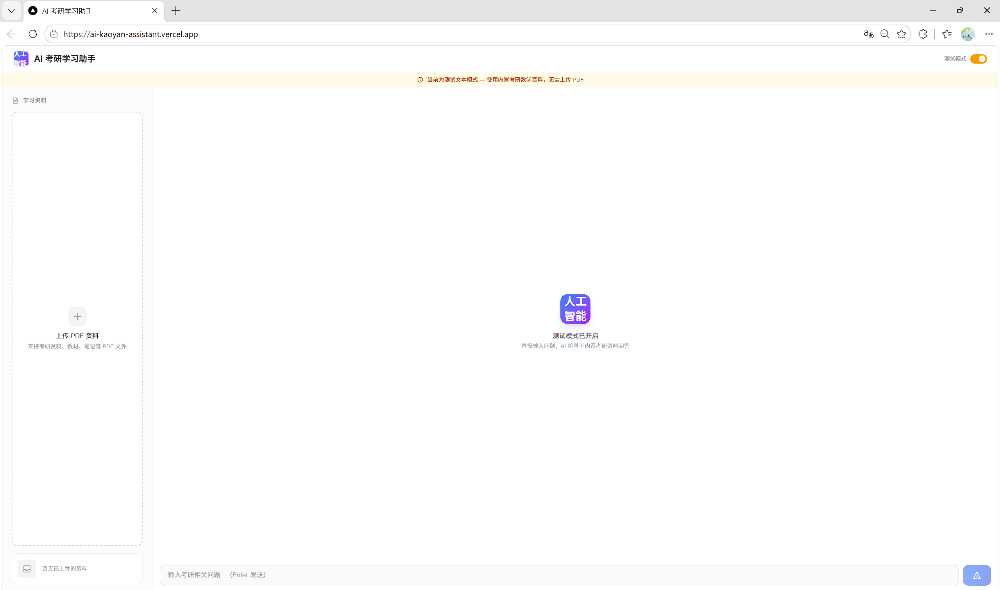
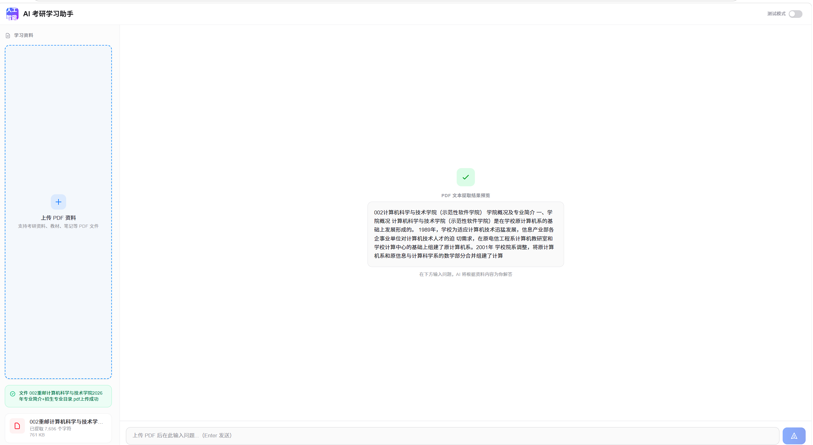
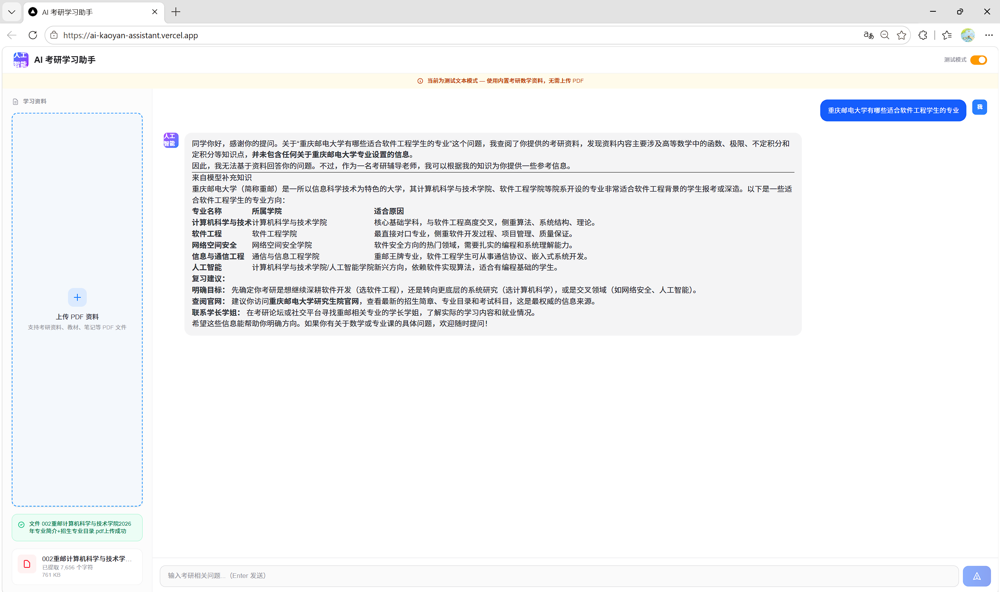
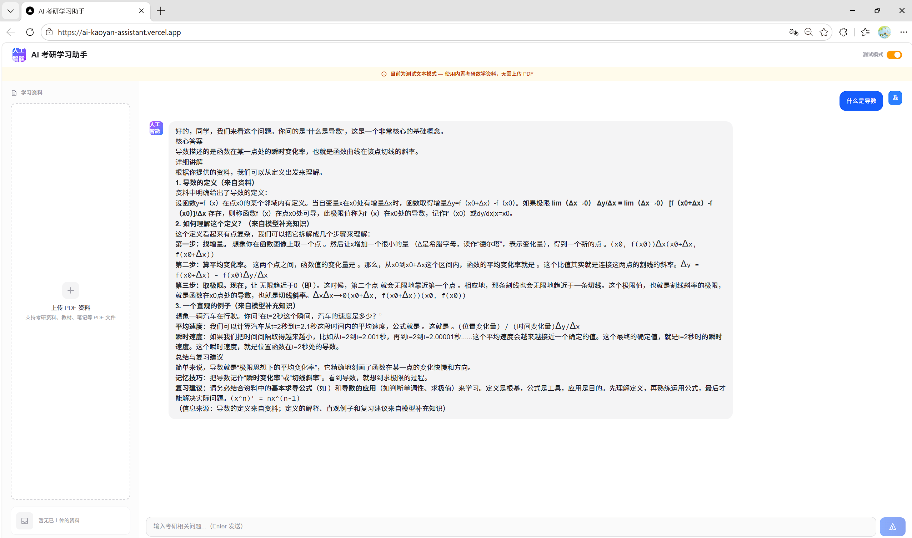

# AI 考研助手

基于 **RAG（检索增强生成）** 的智能考研学习平台。上传考研资料 PDF，AI 即能以考研辅导老师的身份，结合资料内容为你解答问题、梳理解题思路、制定复习策略。

## 项目背景

传统备考中，考生面对大量 PDF 资料时往往难以快速定位所需知识点。AI 考研助手通过将 PDF 资料向量化存储，实现「先检索、再回答」的 RAG 模式，让 AI 的回答有据可依，减少幻觉，提升学习效率。

## 技术栈

| 层级 | 技术 |
|------|------|
| 前端 | Next.js + React + Markdown 渲染 |
| 后端 | FastAPI (Python 3.11) |
| 向量数据库 | ChromaDB（持久化存储） |
| 大模型 | DeepSeek Chat API |
| PDF 解析 | PyPDF2 |
| 部署 | Docker + Koyeb |

## 功能展示

- **PDF 上传与解析** — 上传考研资料 PDF，自动提取全文文字内容
- **智能问答** — 基于 PDF 内容提问，AI 结合资料原文回答，标注信息来源
- **RAG 检索增强** — 文本自动切片 → 向量化 → ChromaDB 存储 → 相似度检索
- **多轮对话** — 支持上下文连续对话，追问无需重复背景
- **测试模式** — 内置考研数学（高数）示例资料，无需上传文件即可体验

## RAG 工作流程

```
用户上传 PDF
    │
    ▼
┌──────────────┐
│  PyPDF2 提取  │  提取 PDF 中的纯文本
│  文字内容     │
└──────┬───────┘
       │
       ▼
┌──────────────┐
│  文本切片     │  按段落 + 重叠窗口，切成 400 字小块
│  (split_text) │  重叠 50 字保持上下文连续性
└──────┬───────┘
       │
       ▼
┌──────────────┐
│  向量化       │  每个切片 → 2‑gram 哈希 → 256 维向量
│  (Embedding)  │  归一化处理，不依赖外部模型下载
└──────┬───────┘
       │
       ▼
┌──────────────┐
│  ChromaDB     │  向量持久化存储，以 PDF 文件名为集合名
│  存储索引     │  支持多份资料独立检索
└──────┬───────┘
       │
       ▼  (用户提问时)
┌──────────────┐
│  相似度检索   │  问题向量化 → 与库中切片比对 → 返回 Top‑3
│  (search)     │  输出距离 + 相似度分数
└──────┬───────┘
       │
       ▼
┌──────────────┐
│  DeepSeek     │  检索结果作为上下文 + 用户问题 + 历史对话
│  生成回答     │  → 结构化 prompt → 模型生成回答
└──────────────┘
```

### Embedding 方案说明

采用轻量级 **2-gram 哈希向量化**，不依赖任何外部嵌入模型（无需下载 HuggingFace 模型），原理如下：

1. 提取文本中每两个连续字符（2-gram）
2. 对每个 2-gram 做 MD5 哈希，映射到 256 维向量中的某个位置
3. 相似文本会产生更多相同的 2-gram，向量在高维空间中自然靠近

> 该方案适合课程演示和快速原型验证。生产环境可更换为 text2vec 或 OpenAI Embeddings 以获得语义级检索精度。

## 项目结构

```
ai-kaoyan-assistant/
├── backend/                    # FastAPI 后端
│   ├── app/
│   │   ├── main.py             # 应用入口，CORS 配置
│   │   ├── config.py           # 环境变量 & 路径常量
│   │   ├── db.py               # 数据库预留
│   │   ├── routers/
│   │   │   ├── health.py       # GET /health 健康检查
│   │   │   ├── pdf.py          # POST /api/pdf/upload PDF 上传
│   │   │   └── chat.py         # POST /api/chat/ask 智能问答
│   │   ├── services/
│   │   │   ├── ai.py           # DeepSeek API 调用封装
│   │   │   ├── rag_service.py  # 文本切片 / 向量化 / 检索
│   │   │   └── pdf_service.py  # PDF 文件存储与文本提取
│   │   └── models/             # 数据模型预留
│   └── requirements.txt        # Python 依赖
├── frontend/                   # Next.js 前端
├── Dockerfile                  # Koyeb 部署配置
├── .dockerignore
└── .gitignore
```

## 快速开始

### 环境要求

- Python 3.11+
- DeepSeek API Key（[申请地址](https://platform.deepseek.com/)）

### 本地运行

```bash
# 1. 克隆仓库
git clone https://github.com/SJYOUNG-QF/ai-kaoyan-assistant.git
cd ai-kaoyan-assistant/backend

# 2. 创建虚拟环境
python -m venv venv
source venv/bin/activate   # Windows: venv\Scripts\activate

# 3. 安装依赖
pip install -r requirements.txt

# 4. 配置环境变量（创建 .env 文件）
echo DEEPSEEK_API_KEY=你的API密钥 > .env

# 5. 启动服务
uvicorn app.main:app --reload --port 8000

# 6. 访问
# API 文档: http://localhost:8000/docs
# 健康检查: http://localhost:8000/health
```

### 测试 RAG 功能

无需上传 PDF，直接调用测试接口：

```bash
curl -X POST http://localhost:8000/api/chat/ask \
  -H "Content-Type: application/json" \
  -d '{"question": "什么是导数？", "use_test_text": true}'
```

内置测试数据覆盖：函数与极限、导数、不定积分、定积分等高等数学核心章节。

## 部署

本项目使用 **Koyeb** 部署，通过根目录 `Dockerfile` 构建镜像。

### 部署步骤

1. **Fork 本仓库** 到你的 GitHub 账号
2. **注册 Koyeb** → [koyeb.com](https://www.koyeb.com/)
3. **创建 App** → 选择 "Deploy from GitHub" → 授权并选择仓库
4. **配置环境变量**：
   - `DEEPSEEK_API_KEY` — DeepSeek API 密钥
   - `DEEPSEEK_BASE_URL` — （可选）API 地址，默认 `https://api.deepseek.com`
   - `FRONTEND_URL` — （可选）前端地址，用于 CORS 跨域配置
5. **点击 Deploy** — Koyeb 自动构建 Docker 镜像并启动服务
6. 部署完成后，Koyeb 会提供一个 `https://xxx.koyeb.app` 的公开地址

### API 接口

| 方法 | 路径 | 说明 |
|------|------|------|
| GET | `/health` | 健康检查 |
| POST | `/api/pdf/upload` | 上传 PDF 文件 |
| POST | `/api/chat/ask` | 向 AI 提问 |

## 页面截图

| 首页 | 问答界面 |
|------|----------|
|  |  |

| 资料上传 | AI 回答 |
|----------|---------|
|  |  |

> 截图存放路径：`docs/screenshots/`，部署后可替换为实际页面截图。

## 后续优化方向

- [ ] **语义 Embedding** — 接入 text2vec-large-chinese 或 OpenAI Embeddings，提升检索精度
- [ ] **用户系统** — 登录注册，个人资料库隔离
- [ ] **多格式支持** — 支持 Word、Markdown、网页链接等资料导入
- [ ] **数据持久化** — 接入云存储（如 AWS S3）+ 托管向量数据库（如 Pinecone）
- [ ] **流式响应** — API 支持 SSE 流式输出，提升对话体验
- [ ] **错题本** — 自动识别用户薄弱知识点，生成针对性练习题
- [ ] **学习进度追踪** — 可视化各章节掌握程度
- [ ] **移动端适配** — 响应式布局 + PWA 支持

## 开源协议

MIT License

---

*Built with FastAPI & DeepSeek*
